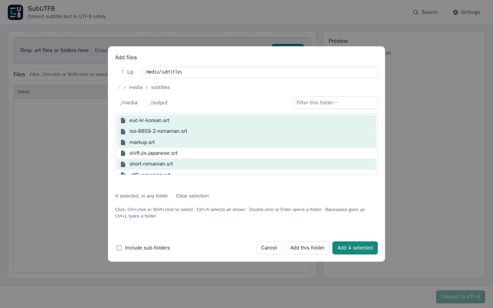
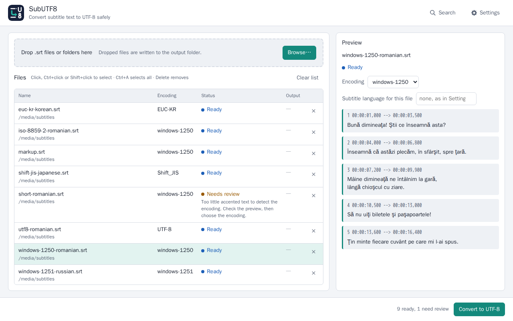
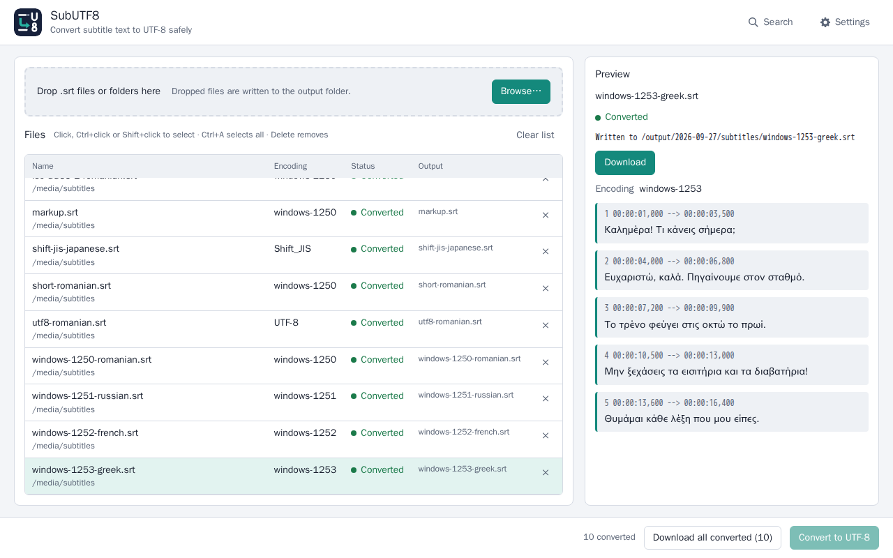
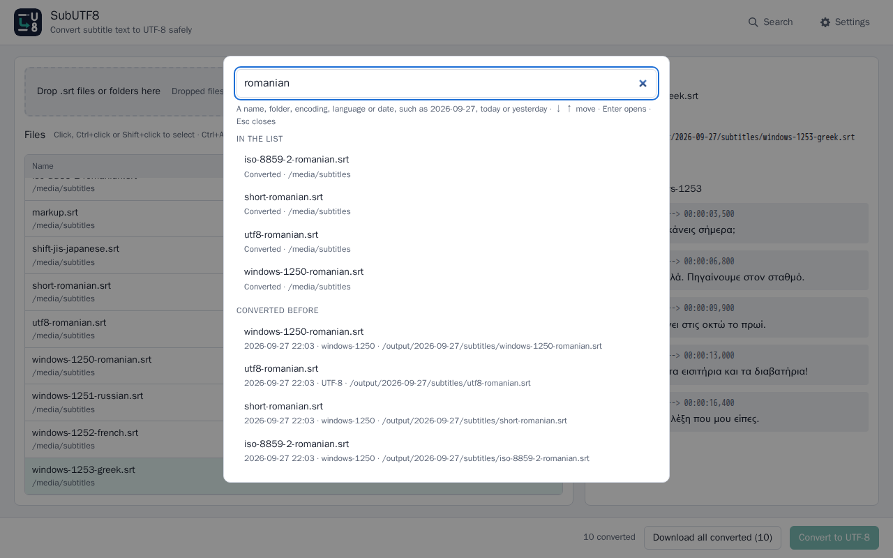
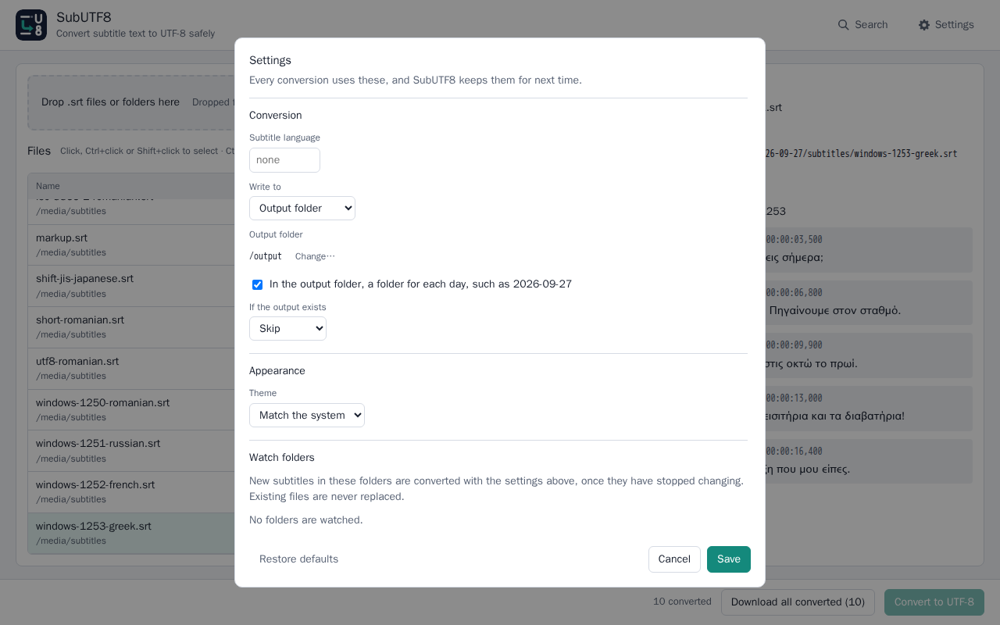

# SubUTF8

**Convert subtitle files to UTF-8, safely, without touching their timing or text**

SubUTF8 converts the text encoding of `.srt` subtitle files to UTF-8 without changing subtitle content or timing. It detects the old encoding, shows a preview before anything is written, and never writes over the originals. Every output is UTF-8 with a byte-order mark, the form MKVToolNix, media players and TVs recognise. Run it as a small Docker container on a server or NAS, **or** install it as a desktop app (`.deb` / `.rpm` / AppImage).


---

## Screenshots

**Browse** — the folders mounted into the container, with breadcrumbs, a filter and file-manager selection:



**Check before converting** — each file's detected encoding and status, with a preview of its text:



**Results** — every file converted and verified, in today's folder under `/output`, with the originals untouched:



**Search** — Ctrl+K finds settings, files in the list and every file converted before:



**Settings** — the defaults SubUTF8 starts with, the theme and, in Docker, folders to watch:



*The files shown are SubUTF8's own sample subtitles, in ten different encodings.*

---

## Features

### Conversion
- **Encoding detection** — legacy encodings for every major language family, tuned for Romanian (windows-1250, ISO-8859-2, ISO-8859-16), plus UTF-16.
- **Correct Romanian letters** — optionally write ș ț instead of the ş ţ that old Romanian encodings give (Settings → Romanian letters, shown when the subtitle language is Romanian).
- **Mixed files** — a file that is part UTF-8 and part another encoding keeps its UTF-8 lines, and only the rest is converted.
- **Old file names** — files whose names were written in an old encoding, such as `Fată.srt` from an old archive, are read with the file's own encoding, and their outputs get proper UTF-8 names.
- **Garbled files** — a UTF-8 file that was misread before it was saved, such as "Bunã dimineaþa!", shows the line as it is and repaired ("Bună dimineaţa!"), and you choose Repair or Keep as it is.
- **Never guesses silently** — when detection is unsure, the file waits as *Needs review*; the preview shows its text in the encoding you pick before anything is written.
- **Exact** — cue numbers, timings, text, markup such as `<i>`, blank lines and line endings (CRLF, LF, CR, even mixed) are kept byte for byte. Only the encoding changes.
- **Recognised as UTF-8** — every output starts with a UTF-8 byte-order mark, so MKVToolNix and players identify it. Files that are already UTF-8 get the mark too.
- **Language tags** — optionally name outputs `Film.ro.srt`, which MKVToolNix and players read as the subtitle language. Set one language in Settings, and give any file its own in the preview. For languages whose old subtitles use their own encodings, such as Romanian, Russian or Greek, the language also helps detection; the suggestions mark them "helps detection".

### Safety
- **Originals are never changed** — outputs go beside them (`Film1.srt`, or `Film.ro.srt` with a language) or into an output folder you choose.
- **Download in the browser** — converted files can be downloaded one by one or all together, so subtitles dropped onto SubUTF8 on a server come back to your own machine.
- **Verified writes** — each output is written to a temporary file, read back and checked before it gets its name. A failure leaves nothing behind.
- **Existing outputs** — skip, rename or overwrite, as you choose. A file in the list is never overwritten.
- **Private** — no telemetry. The only outgoing connection is a check of GitHub for a newer release, once a day or when you click **Check for updates**; turn the daily check off in Settings, or every check with `SUBUTF8_UPDATE_CHECK=0`.

### Settings, search and automation
- **Saved defaults** — subtitle language, where to write, output folder, what to do when an output exists, and a light or dark theme, in Settings.
- **A folder for each day** — outputs can go into dated folders such as `2026-09-27`; in Docker, the mounted `/output` keeps every converted file this way.
- **Search** — one box (**Ctrl+K**) finds settings, files in the list, and every file converted before, by name, folder, encoding, language or date.
- **Watch folders (Docker)** — new subtitles in chosen folders are converted automatically with your saved defaults, once they have finished copying. Existing files are never replaced.
- **Updates** — Settings shows whether SubUTF8 is up to date, and **Check for updates** asks GitHub at once and says what it found. A notice appears when a new version is out. The desktop app downloads it, checks its SHA-256, asks whether to install it, installs it with your password and offers to restart; Docker shows the command to pull it.

### Interface
- **File-manager selection** — click, Ctrl+click, Shift+click, Ctrl+A, the arrow keys and Delete, in the file list and in Browse.
- **Drag and drop** — files and whole folders.
- **Desktop app** — its own window with the app icon in the taskbar and menu, the system's file picker, and "Open with SubUTF8" for `.srt` files.
- **Docker** — an in-app browser for the mounted folders, with breadcrumbs, a filter, a selection kept across folders and full keyboard use.

---

## Quick Start

### Docker (servers / NAS)

```bash
mkdir -p ~/subutf8 && cd ~/subutf8
wget https://raw.githubusercontent.com/aiulian25/subutf8/main/docker-compose.yml
nano docker-compose.yml # set your subtitles folder, the output folder and your time zone
docker compose up -d
```

Create the output folder before the first start, so it belongs to you (`PUID`/`PGID`). Open **http://&lt;server-ip&gt;:61880** from any machine on your network.

> **Just pull, never build.** `ghcr.io/aiulian25/subutf8:latest` is a ready-made `linux/amd64` image.

### Desktop (deb / rpm / AppImage — x86_64)

Download the latest release from the [Releases page](https://github.com/aiulian25/subutf8/releases).

**Debian / Ubuntu:**
```bash
sudo apt install ./subutf8_1.2.0_amd64.deb
```

**Fedora / RHEL:**
```bash
sudo dnf install ./subutf8-1.2.0-1.x86_64.rpm
```

**AppImage (any distro):**
```bash
chmod +x SubUTF8-1.2.0-x86_64.AppImage
./SubUTF8-1.2.0-x86_64.AppImage
```
The first launch adds SubUTF8 to your application menu; `./SubUTF8-1.2.0-x86_64.AppImage --remove-integration` takes it out again. Uninstalling leaves your settings and history in `~/.config/subutf8`; delete that folder to remove them too.

### Updating

- **Desktop** — when a new version is out, SubUTF8 says so. **Settings → Updates → Download update**, then **Install update** (your password, in the system's own dialog) and **Restart SubUTF8**. The AppImage replaces itself.
- **Docker** — `docker compose pull && docker compose up -d`. Settings and the history stay in the `subutf8-data` volume.

---

## Supported Platforms

| | |
|---|---|
| Docker image | `ghcr.io/aiulian25/subutf8`, `linux/amd64` |
| Docker | Engine 20.10 or newer, with Compose v2 (`docker compose`) |
| Desktop packages | x86_64: Ubuntu 22.04+, Debian 12+, Fedora 43+; the AppImage runs on any of them |
| Desktop window | WebKitGTK 4.1, which the `.deb` and `.rpm` install. Without it the app opens in your browser |

There are no arm64 builds.

---

## Using it

1. Add files with **Add files…** or **Add folder…**, which open the system's file picker, or drag `.srt` files or whole folders onto the window. In Docker, **Browse…** shows the mounted folders.
2. Check each file's encoding and status. Select a file to preview its text; if it reads wrongly or needs review, choose another encoding. Lists select as in a file manager: Ctrl+click, Shift+click, Ctrl+A, the arrow keys and Delete.
3. In **Settings**, optionally set the subtitle language, which adds a tag such as `Film.ro.srt`, where to write, and what to do when an output already exists. They apply at once and are kept for next time, with the theme.
4. Press **Convert to UTF-8** and read the results. Skipped or failed files are tried again on the next Convert, for example after choosing to overwrite.
5. **Search** (Ctrl+K) finds any setting, any file in the list, and any file converted before, for example by typing `today` or a file name.

In Docker, **Settings → Watch folders** adds folders whose new subtitles are converted automatically. Files that need a person, such as those whose encoding is unsure, wait in the list.

---

## Configuration (Docker)

### Environment variables

| Variable | Default | Meaning |
|---|---|---|
| `PUID` / `PGID` | `1000` | The user and group converted files belong to (`id -u`, `id -g`). Set them in a `.env` file next to `docker-compose.yml`; see [.env.example](.env.example) |
| `SUBUTF8_BROWSE_ROOTS` | — | More folders to browse besides `/media` and `/mnt`, separated by colons. Mount them too |
| `SUBUTF8_ALLOWED_HOSTS` | — | Host names to answer to besides IP addresses and `localhost`, separated by commas, for example behind a reverse proxy |
| `TZ` | UTC | Your time zone, such as `Europe/London`; it names the daily folders and the times in the history |
| `SUBUTF8_WATCH_INTERVAL` | `60` | How often watched folders are checked, in seconds |
| `SUBUTF8_UPDATE_CHECK` | on | `0` turns the daily check for a new version off |

### Volume mounts

Everything mounted under `/media` or `/mnt` shows up in Browse and can be watched. `/output` receives converted files, in a folder for each day, and `/data` keeps the settings and the history. Add `:ro` to the subtitle folders to protect the originals; converted files then go to `/output`.

```yaml
volumes:
  # Settings and the history
  - subutf8-data:/data
  # Converted files, one folder per day
  - /path/to/converted:/output
  # One folder
  - /path/to/your/subtitles:/media/subtitles
  # More folders
  - /path/to/movies:/media/movies
  # A network share mounted on the host
  - /path/to/nas-share:/mnt/nas
```

### Port

`61880`. Publish it as `"127.0.0.1:61880:61880"` to keep the app on the server only.

---

## Security

- **No login.** Anyone who can reach the port can convert subtitles in the mounted folders. Use it on a trusted network, or put a reverse proxy with HTTPS and a login in front of it and add the proxy's host name to `SUBUTF8_ALLOWED_HOSTS`.
- **Other websites are kept out.** Every request needs a header a web page on another site cannot add, and requests naming any host other than an IP address, `localhost` or an allowed name are rejected.
- **Small and locked down.** The image holds one static program on `scratch`, runs as a non-root user with a read-only file system and no Linux capabilities, and reads and writes only the mounted folders.
- **Desktop** — the app listens on `127.0.0.1` only, on a new random port at each launch, and every request carries a secret token.
- **Updates** — the check and the download talk to GitHub only, over HTTPS; a download is kept only if its size and SHA-256 match the release's, and is checked again just before installing. SubUTF8 never runs as root: the package manager installs through `pkexec`, which asks for your password. The container never updates itself.
- **Your data** — settings and the history of converted files (file names and paths, never subtitle text) stay in `~/.config/subutf8` on the desktop or `/data` in Docker, readable only by you.

---

## Troubleshooting

- **"No folders are mounted"** — mount a folder under `/media` or `/mnt` (see Volume mounts) and restart the container.
- **"The folder mounted at /output cannot be written to"** — give the server's folder to `PUID:PGID`, for example `sudo chown 1000:1000 /path/to/converted`.
- **"Settings and the list of converted files cannot be saved"** — mount `/data`, as `docker-compose.yml` shows.
- **"Folder is read-only: choose an output folder"** — the folder is mounted `:ro` or cannot be written by `PUID:PGID`. Press **Write the skipped files to …** above the list to send them to the output folder, choose another output folder in Settings, or fix the mount's permissions.
- **"The output file already exists"** — choose Rename or Overwrite under *If the output exists* and press Convert again.
- **A file shows *Needs review*** — select it, look at the preview, and pick the encoding that makes the text read correctly.
- **The desktop window does not open** — install WebKitGTK 4.1 (`libwebkit2gtk-4.1-0` on Debian and Ubuntu, `webkit2gtk4.1` on Fedora). Until then the app opens in your browser.

---

## What's New

### v1.2.0

- **Mixed and garbled files.** A file that is part UTF-8 and part an old encoding keeps its UTF-8 lines. A UTF-8 file that was misread before it reached you, such as "Bunã dimineaþa!", can be repaired, after you compare the line both ways.
- **Suggestions you can read, and help for short files.** A file that needs review lists the encodings that fit, each with its first accented line in that encoding, and an episode with too little text is offered the encoding the rest of its folder has.
- **A subtitle language for each file**, and a list that marks which languages help detection. With Romanian, Settings can write the correct letters ș ț.
- **Problems named by line.** "This encoding does not fit line 3" instead of a byte number, with the broken line shown; repeated warnings are summed up in one line.
- **Download in the browser.** Converted files can be downloaded one by one or all together.
- **Docker without `/output`.** The default output folder is the first mounted folder SubUTF8 can write to, and one button sends files from read-only folders there.
- **Old file names.** Subtitles whose names are in an old encoding, such as `Fată.srt` from an old archive, are listed and converted to proper UTF-8 names.
- **Settings in one place, and a clearer update check.** Every conversion setting lives in Settings; **Check for updates** says what it found, and a downloaded update asks to be installed.

Settings saved by 1.1.0 carry over. Desktop: update from **Settings → Updates**. Docker: `docker compose pull && docker compose up -d`.

### v1.1.0

- **Settings.** Save your defaults (language, where to write, output folder, existing outputs) and choose a light, dark or system theme.
- **A folder for each day.** Converted files can go into dated folders; Docker keeps them in the mounted `/output`.
- **Search.** Ctrl+K finds settings, listed files and every file converted before, by name, folder or date.
- **Watch folders (Docker).** New subtitles in chosen folders convert automatically with the saved defaults.
- **Updates.** A notice when a new version is out; the desktop app downloads, verifies, installs and restarts itself.
- **No doubled tags, no copies of copies.** `Film.ro.srt` converted with `ro` becomes `Film1.ro.srt`, not `Film.ro.ro.srt`, and SubUTF8's own outputs are left alone when their folder is added again.

### v1.0.0

The first public release.

- **Recognised as UTF-8 everywhere.** Every converted file starts with a UTF-8 byte-order mark, the form MKVToolNix and players look for. Files that were already UTF-8 get the mark too, so every subtitle you mux shows up as UTF-8.
- **Docker image and desktop packages.** Pull `ghcr.io/aiulian25/subutf8` on a server or NAS, or install the `.deb`, `.rpm` or AppImage on an x86_64 desktop.
- **Works like a file manager.** Ctrl+click, Shift+click, Ctrl+A and the keyboard in every list; drag and drop onto the window; the system's own file picker on the desktop.

---

## License

MIT — see [LICENSE](LICENSE). The licences of the included Rust crates ship inside the image and with every package.
